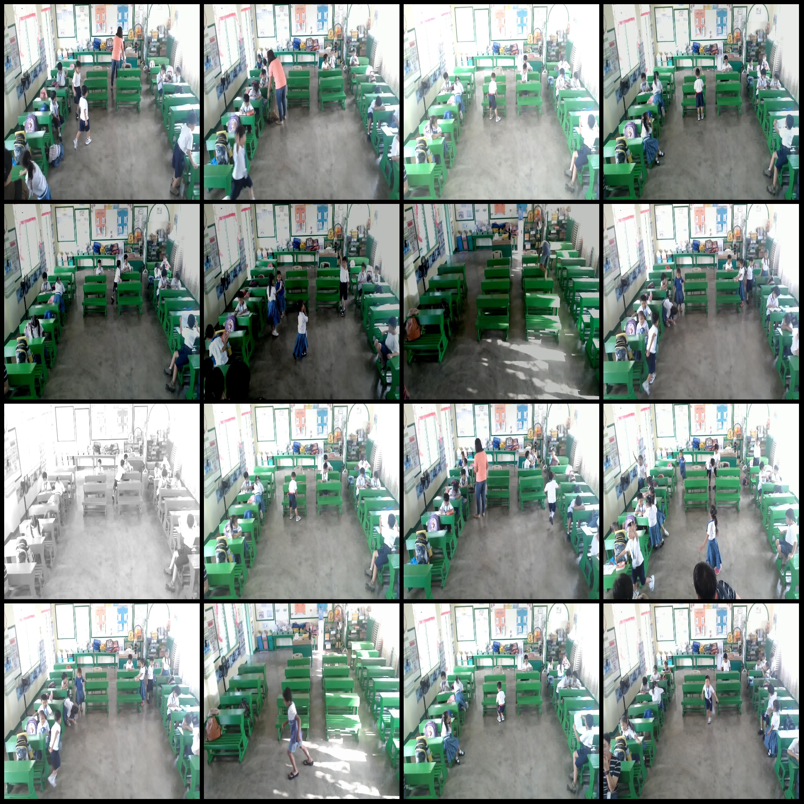
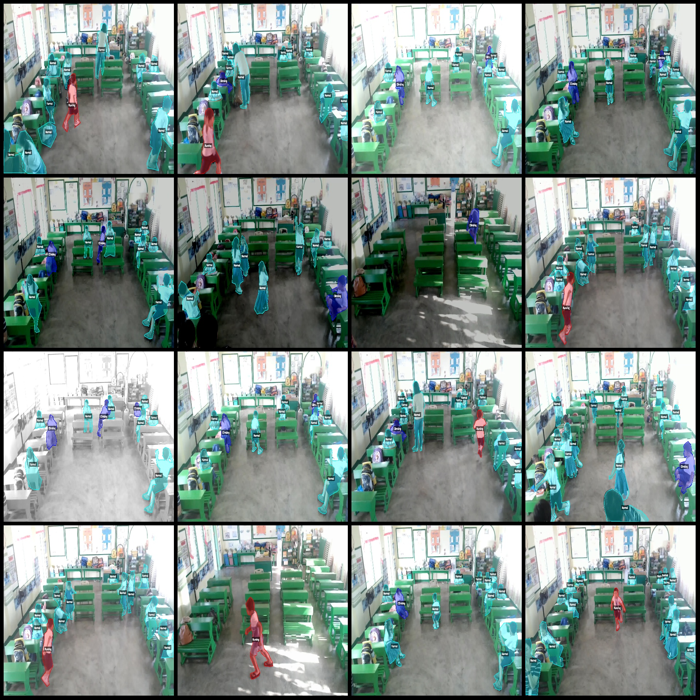
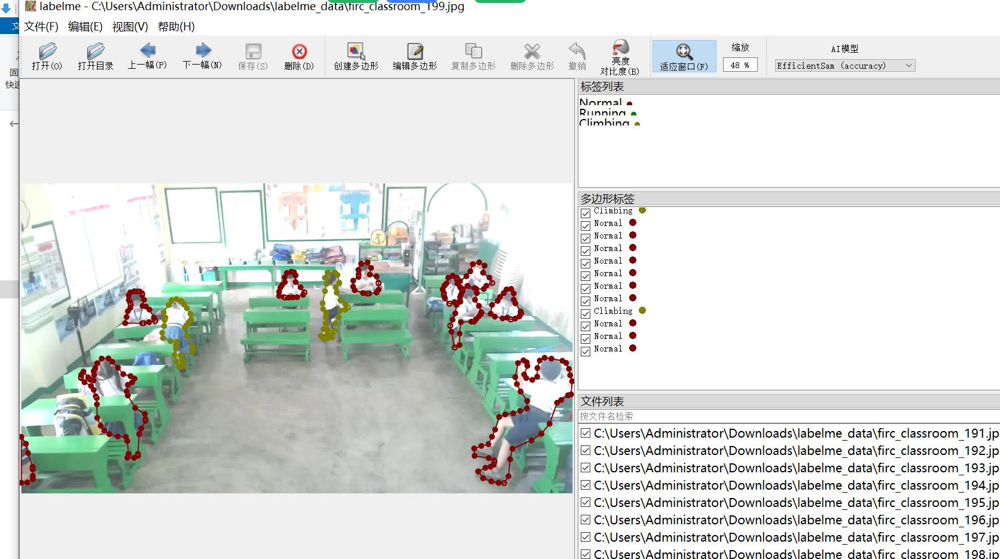
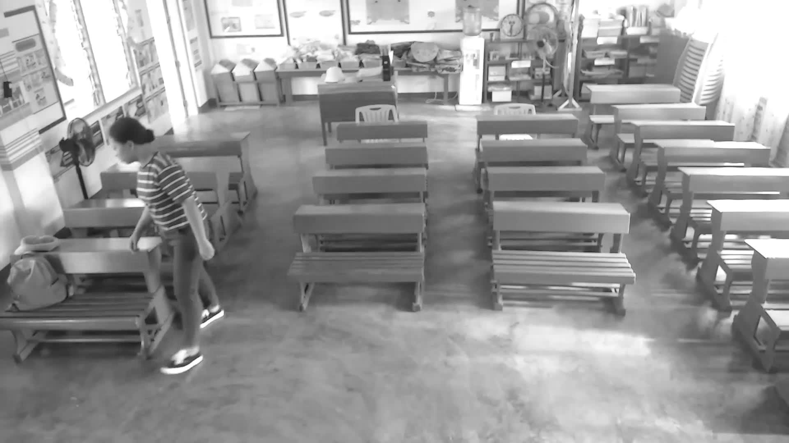
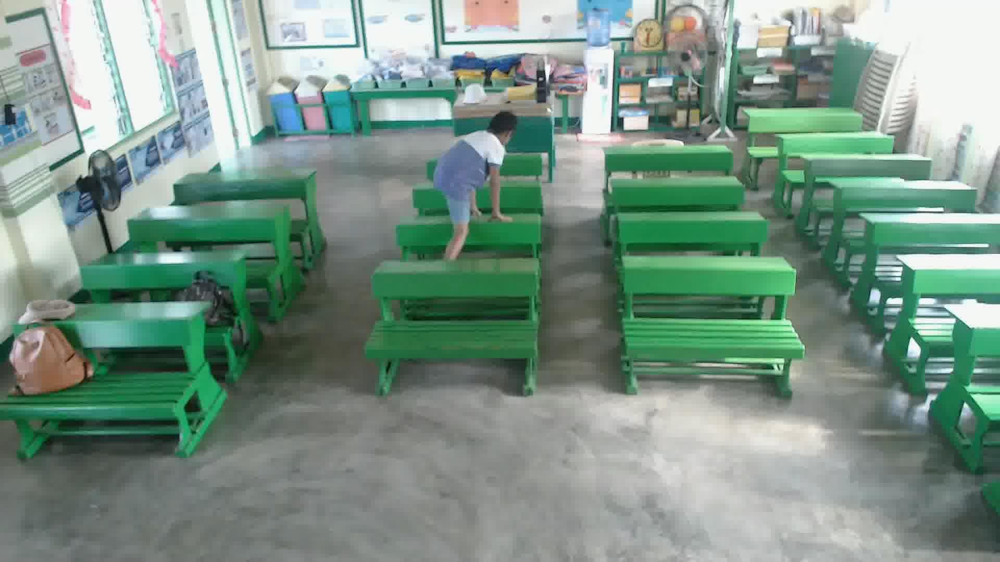
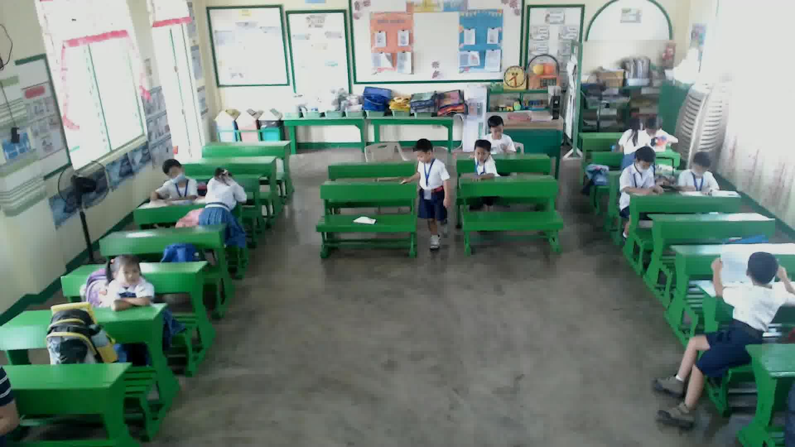

# Classroom Student Behavior Identification and Segmentation Dataset (LabelMe)

1420 Images, 4 Categories

Please note that the dataset mainly includes enhanced images with brightness and contrast enhancements. The images are not very clear, so please refer to the images for details.

Dataset format: LabelMe format (without mask files, only containing jpg images and corresponding json files).

Number of images (number of jpg files): 1420
Number of annotations (json file count): 1420
Number of annotation categories: 4
Annotation categories: ["Climbing", "Normal", "Running", "Tampering"]
Number of bounding box counts for each category:
Climbing count = 1327
Normal count = 12275
Running count = 546
Tampering count = 178
Total bounding boxes: 14326

Annotation tools used: labelme=5.5.0
Image resolution: 1920x1080
Annotation rules: Polygons are drawn around the categories for each image.

Important notes: The dataset can be edited in LabelMe, but the json dataset needs to be converted into mask or Yolo/COCO format for semantic segmentation or instance segmentation.

Special declaration: This dataset does not guarantee any accuracy in training models or weight files.

Image preview:

Example annotation:

Randomly selected 16 images for annotation:

Annotation drawing results:

LabelMe editing example:
## Images

Here is a pay link on Stripe ( https://buy.stripe.com/3cs8yP7sY87d0vu9AB ). Please contact me lonlonago@foxmail.com after funding $89, and I will send you a complete data files , thank you!

